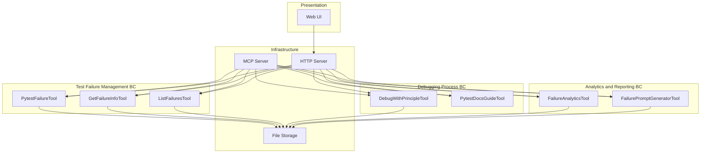
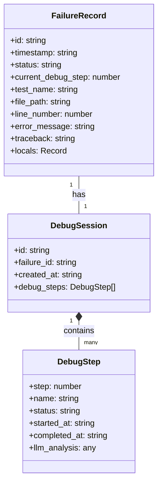
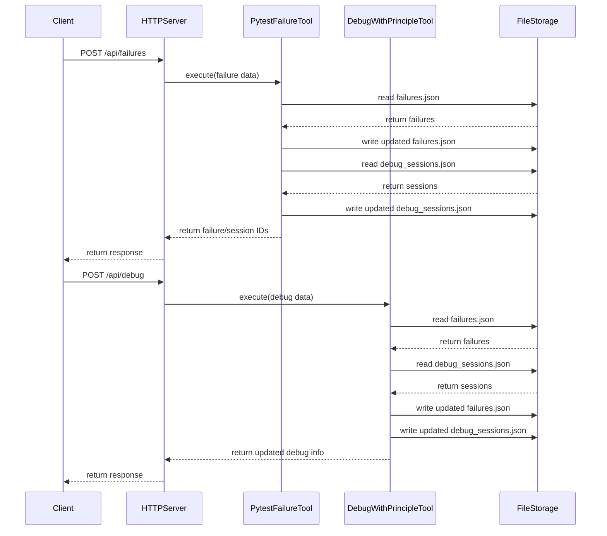

# Title: MCP Tools Architecture for Pytest Debugging

## Status: Accepted

## Context
The system needs to provide a framework for systematically debugging pytest failures using David Agans' 9 principles of debugging. The problem domain involves capturing test failures, organizing debugging sessions, and providing a structured approach to analyze and resolve issues. This requires a robust architecture that can handle both interactive debugging through an LLM interface and visualization through a web UI.

The system operates within the Bounded Context of automated test debugging and failure analysis. It needs to maintain state across debugging sessions and provide clear progressions through the debugging principles.

## Decision
The architecture follows a tool-based approach where each debugging capability is implemented as a separate Model Context Protocol (MCP) tool. These tools are registered with an MCP server that handles discovery and invocation.

Key architectural decisions:
1. Use of Model Context Protocol (MCP) for LLM integration
2. Implementation of discrete tools for each functionality
3. JSON-based storage for failure data and debug sessions
4. HTTP API layer to expose functionality to web clients
5. React-based web UI for visualization

The tools are orchestrated by a central MCP server that automatically discovers and registers them. The core domain logic resides in these tools, with each encapsulating specific functionality and maintaining its own internal state.

## Identified DDD Elements

### Aggregates
1. **Failure Aggregate** - Root entity is the `FailureRecord` which contains information about a test failure including its current state, debug progress, and related debug sessions.
2. **Debug Session Aggregate** - Root entity is the `DebugSession` which represents a debugging effort for a specific failure, containing multiple `DebugStep` entities.

### Entities
1. **FailureRecord** - Represents a specific test failure with its traceback, error message, and status.
2. **DebugSession** - Represents a debugging session for a specific failure.
3. **DebugStep** - Represents the application of a specific debugging principle within a session.

### Value Objects
1. **PytestFailureInput** - Contains the immutable data about a test failure.
2. **DebugPrincipleAnalysis** - Contains the analysis data for a specific debugging principle.

### Domain Services
1. **PytestFailureTool** - Service for registering new failures.
2. **DebugWithPrincipleTool** - Service for applying debugging principles to failures.
3. **FailureAnalyticsTool** - Service for analyzing patterns across failures.
4. **FailurePromptGeneratorTool** - Service for generating debugging prompts.

### Bounded Contexts
1. **Test Failure Management** - Focused on capturing and organizing test failures.
2. **Debugging Process** - Focused on the systematic application of debugging principles.
3. **Analytics and Reporting** - Focused on insights and patterns across failures.

## Dependencies/Interactions
- **MCP Framework** - The system relies on the MCP framework for tool registration and invocation.
- **HTTP Server** - Exposes the tools as RESTful endpoints.
- **Web UI** - Consumes the HTTP API to visualize failures and debugging progress.
- **File System** - Used for persistent storage of failure and session data.

## Technology/Patterns
1. **TypeScript** - Used for type-safe implementation of tools and APIs.
2. **MCP Framework** - Provides the core infrastructure for tool discovery and invocation.
3. **Express.js** - Used for the HTTP server implementation.
4. **React** - Used for the web UI implementation.
5. **Repository Pattern** - Implicit in the tools that access stored data.
6. **Command Pattern** - Used in the tool implementations to encapsulate operations.

## Consequences

### Positive
1. **Modularity** - Each tool has a clear, single responsibility.
2. **Extensibility** - New tools can be easily added without modifying existing ones.
3. **Dual Interface** - The system can be accessed both programmatically via MCP and through a user interface.
4. **Structured Debugging** - The 9 principles provide a systematic approach to debugging.

### Negative
1. **State Management** - State is distributed across JSON files, making transactions challenging.
2. **Limited Scalability** - The file-based storage approach may not scale well with many failures.
3. **Limited Persistence** - JSON files offer limited query capabilities compared to a database.

## Diagrams

### Component Diagram

### Class Diagram for Failure Aggregate

### Sequence Diagram for Debugging Process

