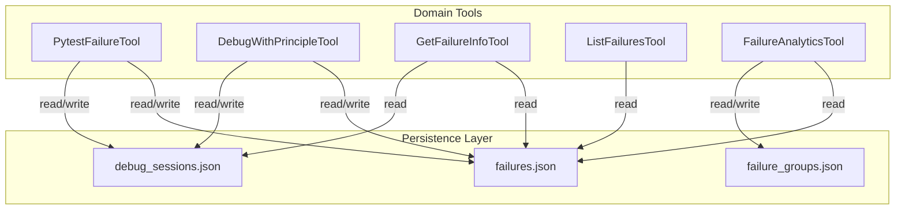
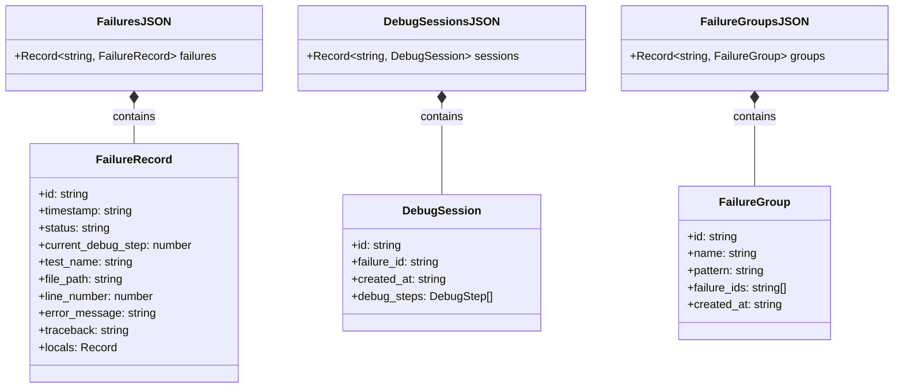
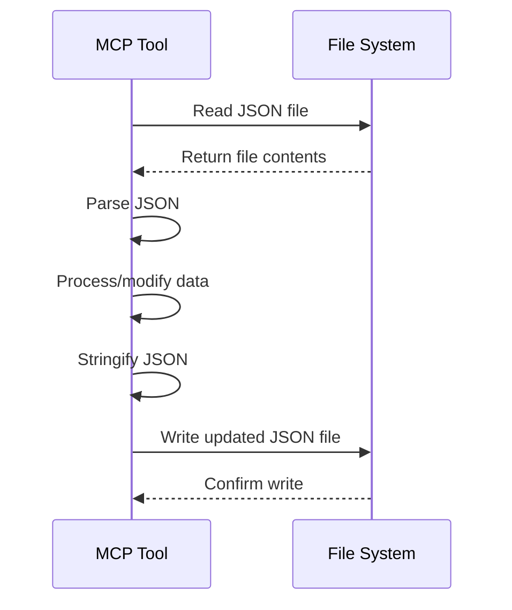

# Title: JSON File-Based Storage for Failure Data

## Status: Accepted

## Context
The pytest MCP server needs to persist data about test failures, debugging sessions, and analytics insights. This data includes various complex structures such as failure records, debugging steps, and relationships between failures and debug sessions.

The primary requirements for the storage solution are:
1. Ability to store hierarchical data with complex relationships
2. Simplicity of implementation and deployment
3. Direct access to data without additional infrastructure
4. Support for the relatively small scale of data expected in debugging scenarios

The main Bounded Context affected is the Test Failure Management context, which needs to store and retrieve failure records and their associated debugging sessions.

## Decision
The architecture uses simple JSON files stored in the local filesystem for all persistence needs. Specifically:

1. `failures.json` - Stores all test failure records
2. `debug_sessions.json` - Stores debugging sessions and their steps
3. `failure_groups.json` - Stores analytics on failure groupings

Each file serves as a simple key-value store, where the keys are identifiers (like failure IDs or session IDs) and the values are the corresponding data structures.

The tools directly read from and write to these files when they need to access or modify data, without an intermediary data access layer or abstraction.

## Identified DDD Elements

### Repositories (Implicit)
1. **Failure Repository** - Implicitly implemented in each tool that accesses the `failures.json` file
2. **Debug Session Repository** - Implicitly implemented in each tool that accesses the `debug_sessions.json` file
3. **Failure Group Repository** - Implicitly implemented in each tool that accesses the `failure_groups.json` file

### Entities
1. **FailureRecord** - Stored in `failures.json` with its ID as the key
2. **DebugSession** - Stored in `debug_sessions.json` with its ID as the key

## Dependencies/Interactions
- **File System** - The system directly depends on the filesystem for all persistence operations
- **Node.js fs Module** - Used for file operations
- **JSON.parse/stringify** - Used for serialization/deserialization

## Technology/Patterns
1. **File-Based Storage** - Using the file system as a simple database
2. **In-Memory Data Loading** - Loading entire JSON files into memory for processing
3. **Complete File Write** - Writing the entire data structure back to file after modifications

## Consequences

### Positive
1. **Simplicity** - No additional infrastructure or database setup required
2. **Portability** - The data can be easily inspected, backed up, or transferred
3. **Schema Flexibility** - JSON structure can evolve without formal migrations
4. **Direct Access** - Tools can directly access and manipulate the data

### Negative
1. **Limited Concurrency** - No built-in mechanisms for handling concurrent access
2. **No Transactions** - No support for atomic operations or transactions
3. **Limited Querying** - No query language or indexing for efficient data retrieval
4. **Scalability Concerns** - May not perform well with very large datasets
5. **No Schema Enforcement** - Structure is enforced only by the application code

## Diagrams

### Component Diagram

### Class Diagram for Storage Structure

### Sequence Diagram for Data Access

