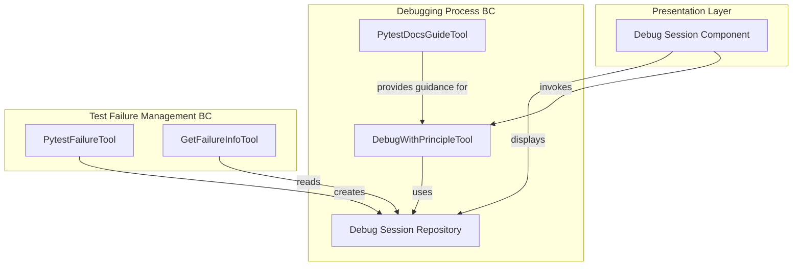
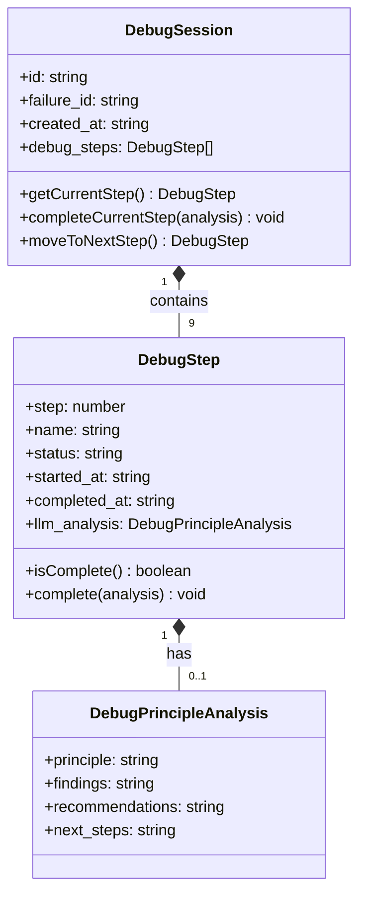
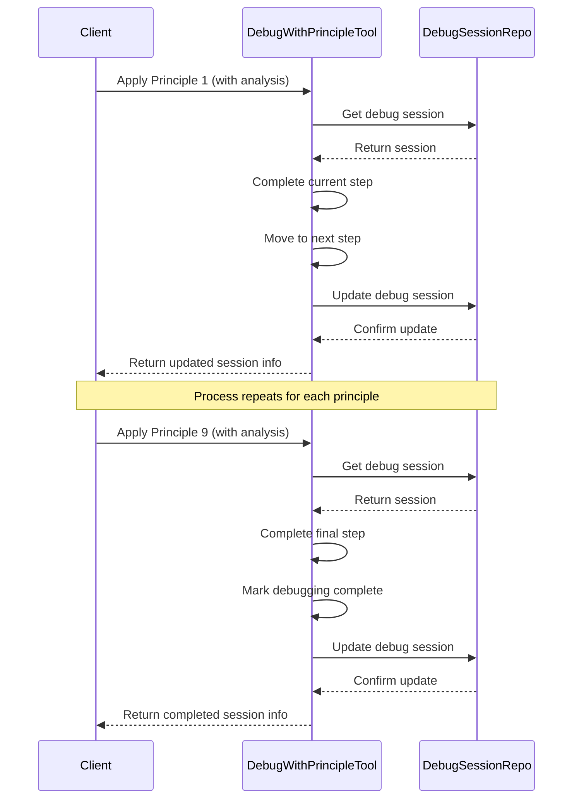

# Title: Structured Debugging Process Using 9 Principles

## Status: Accepted

## Context
Debugging test failures in pytest can be complex and unstructured, often leading to inefficient and ineffective debugging processes. There is a need for a systematic approach to debugging that follows proven methodologies to quickly identify and resolve issues.

The system needs to implement a workflow that guides users through a defined series of debugging steps, capturing insights at each stage and progressing toward resolution in a methodical way.

The primary Bounded Context affected is the Debugging Process context, which is responsible for guiding users (and LLMs) through the structured debugging workflow.

## Decision
The architecture implements a structured debugging process based on David Agans' 9 Rules of Debugging:

1. **Understand the System** - Gain high-level awareness of the code and test behavior
2. **Make It Fail** - Reproduce the failure consistently, eliminate flakiness
3. **Quit Thinking and Look** - Examine actual runtime values and unexpected behavior
4. **Divide and Conquer** - Narrow down where in the code the issue is occurring
5. **Change One Thing at a Time** - Test isolated changes to validate hypotheses
6. **Keep an Audit Trail** - Track changes and their effects during debugging
7. **Check the Plug** - Verify basic configuration and environment issues
8. **Get a Fresh View** - Approach the problem from a different perspective
9. **If You Didn't Fix It, It Ain't Fixed** - Verify your solution works and addresses root causes

Each principle corresponds to a step in the debugging process. For each test failure, a debug session is created with these nine steps, and users (or LLMs) work through them sequentially, recording their analysis and findings at each step.

The `DebugWithPrincipleTool` is the primary service that implements this workflow, allowing users to apply each principle to a failure and record the corresponding analysis.

## Identified DDD Elements

### Aggregates
1. **Debug Session Aggregate** - Root entity is the `DebugSession` which contains a sequence of `DebugStep` entities representing the application of each debugging principle.

### Entities
1. **DebugSession** - Represents a debugging session for a specific failure.
2. **DebugStep** - Represents the application of a specific debugging principle within a session.
   
### Value Objects
1. **DebugPrincipleAnalysis** - Contains the analysis data for a specific debugging principle.

### Domain Services
1. **DebugWithPrincipleTool** - Service for applying debugging principles to failures and recording the analysis.
2. **PytestDocsGuideTool** - Service providing documentation and guidance on the debugging principles.

## Dependencies/Interactions
- **PytestFailureTool** - Creates the initial debug session when a failure is registered.
- **FileStorage** - Stores the debug sessions and their progress.
- **GetFailureInfoTool** - Retrieves information about the debug progress.
- **Web UI Components** - Visualize the debug progress and allow users to interact with the debugging process.

## Technology/Patterns
1. **State Machine Pattern** - The debugging process follows a defined sequence of states (principles).
2. **Command Pattern** - Each application of a principle is encapsulated as a command.
3. **Repository Pattern** - Implicitly used to store and retrieve debug sessions.

## Consequences

### Positive
1. **Structured Approach** - Provides a clear, methodical approach to debugging.
2. **Consistency** - All debugging follows the same process, making it easier to collaborate.
3. **Progress Tracking** - Clear visibility into the debugging progress for each failure.
4. **LLM Integration** - The structured approach is well-suited for LLM-assisted debugging.
5. **Knowledge Capture** - Analysis from each step is preserved for future reference.

### Negative
1. **Potential Rigidity** - The fixed sequence of principles may not be optimal for all types of failures.
2. **Overhead** - Requires users to follow and document each step, potentially slowing down simple debugging tasks.
3. **Learning Curve** - Users need to understand the 9 principles and how to apply them effectively.

## Diagrams

### Component Diagram

### Class Diagram for Debug Session Aggregate

### Sequence Diagram for Debugging Process

