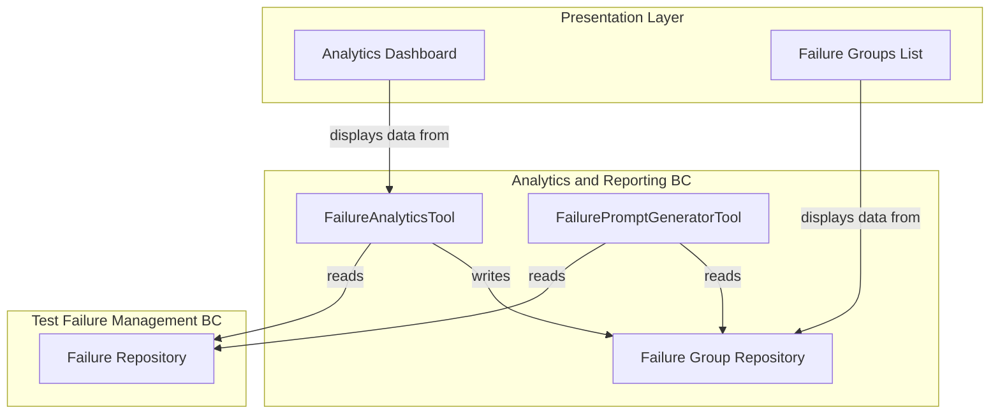
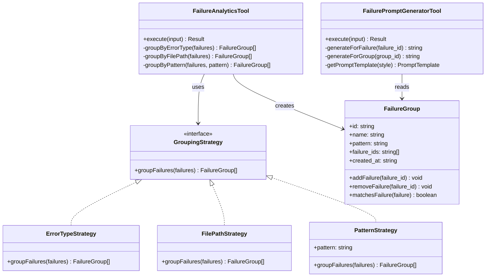
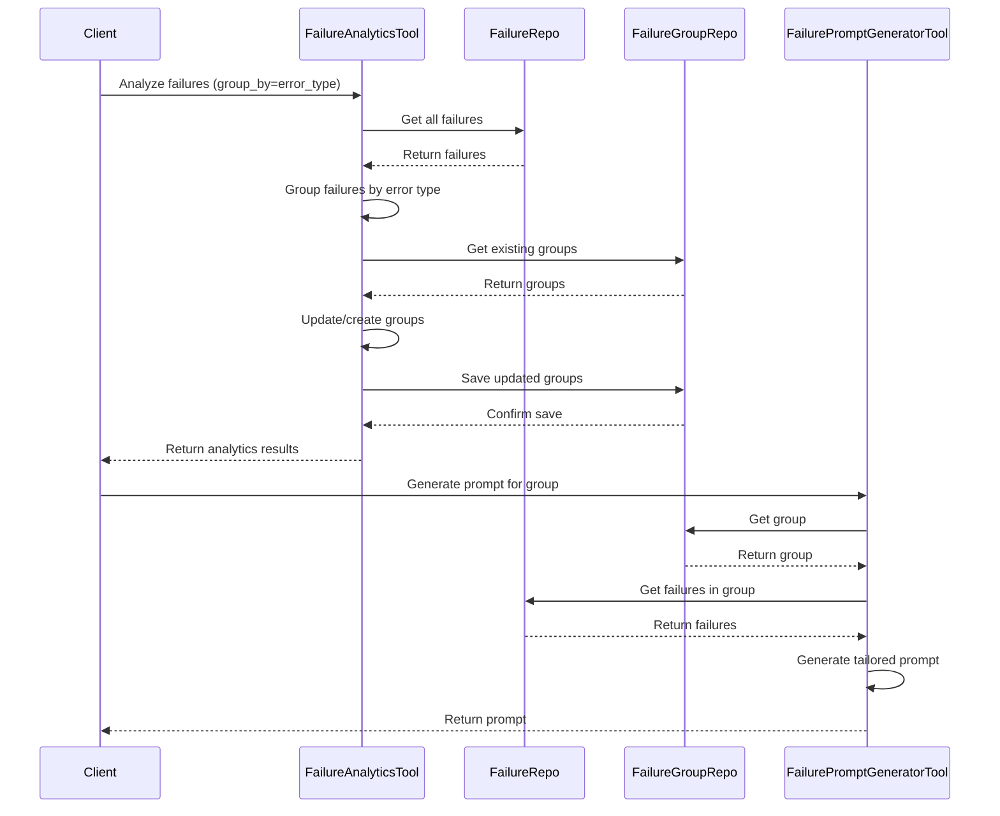

# Title: Failure Analytics and Automated Grouping

## Status: Accepted

## Context
When dealing with numerous test failures over time, it becomes challenging to identify patterns, common root causes, and systemic issues. Manual analysis of failures is time-consuming and prone to missing important connections between seemingly unrelated failures.

The system needs to provide capabilities for automated analysis of test failures, grouping similar failures together, and generating insights to help users quickly focus on the most important issues.

The primary Bounded Context affected is the Analytics and Reporting context, which is responsible for analyzing failure data and deriving actionable insights.

## Decision
The architecture implements analytics and failure grouping capabilities through two primary tools:

1. **FailureAnalyticsTool** - Analyzes failures and groups them based on various criteria (error type, file path, etc.)
2. **FailurePromptGeneratorTool** - Generates targeted debugging prompts based on failure groups or individual failures

The failure analytics process works by:
1. Analyzing the error messages, tracebacks, and other metadata of failures
2. Identifying patterns and similarities between failures
3. Grouping failures based on configurable criteria (error type, file path, or custom patterns)
4. Storing these groups in the `failure_groups.json` file
5. Providing APIs to retrieve and visualize these groups

This approach allows users to quickly identify common failure patterns and prioritize debugging efforts based on the frequency and impact of different failure types.

## Identified DDD Elements

### Aggregates
1. **Failure Group Aggregate** - Root entity is the `FailureGroup` which contains references to multiple `FailureRecord` entities that share common characteristics.

### Entities
1. **FailureGroup** - Represents a group of related failures.

### Value Objects
1. **GroupingCriteria** - Contains the criteria used to group failures.
2. **DebugPromptTemplate** - Contains templates for generating debugging prompts for specific failure types.

### Domain Services
1. **FailureAnalyticsTool** - Service for analyzing and grouping failures.
2. **FailurePromptGeneratorTool** - Service for generating targeted debugging prompts.

## Dependencies/Interactions
- **Failure Repository** - Provides access to failure data for analysis.
- **Failure Group Repository** - Stores and retrieves failure groups.
- **Web UI Components** - Visualize failure analytics and groups.

## Technology/Patterns
1. **Strategy Pattern** - Different grouping strategies can be applied based on the criteria.
2. **Template Method Pattern** - Used for generating debugging prompts from templates.
3. **Observer Pattern** - Analytics are updated when new failures are registered.

## Consequences

### Positive
1. **Pattern Recognition** - Automatically identifies common failure patterns.
2. **Prioritization** - Helps users focus on the most frequent or impactful failures.
3. **Time Savings** - Reduces manual analysis time by pre-grouping similar issues.
4. **Knowledge Reuse** - Debugging approaches for one failure can be applied to similar failures.
5. **LLM Assistance** - Generated prompts optimize LLM-assisted debugging.

### Negative
1. **False Groupings** - May sometimes group unrelated failures together based on superficial similarities.
2. **Missed Connections** - Complex relationships between failures might not be captured by simple grouping criteria.
3. **Complexity** - Adds additional complexity to the system architecture.
4. **Maintenance** - Requires ongoing refinement of grouping algorithms and prompt templates.

## Diagrams

### Component Diagram

### Class Diagram for Failure Groups

### Sequence Diagram for Analytics Process

