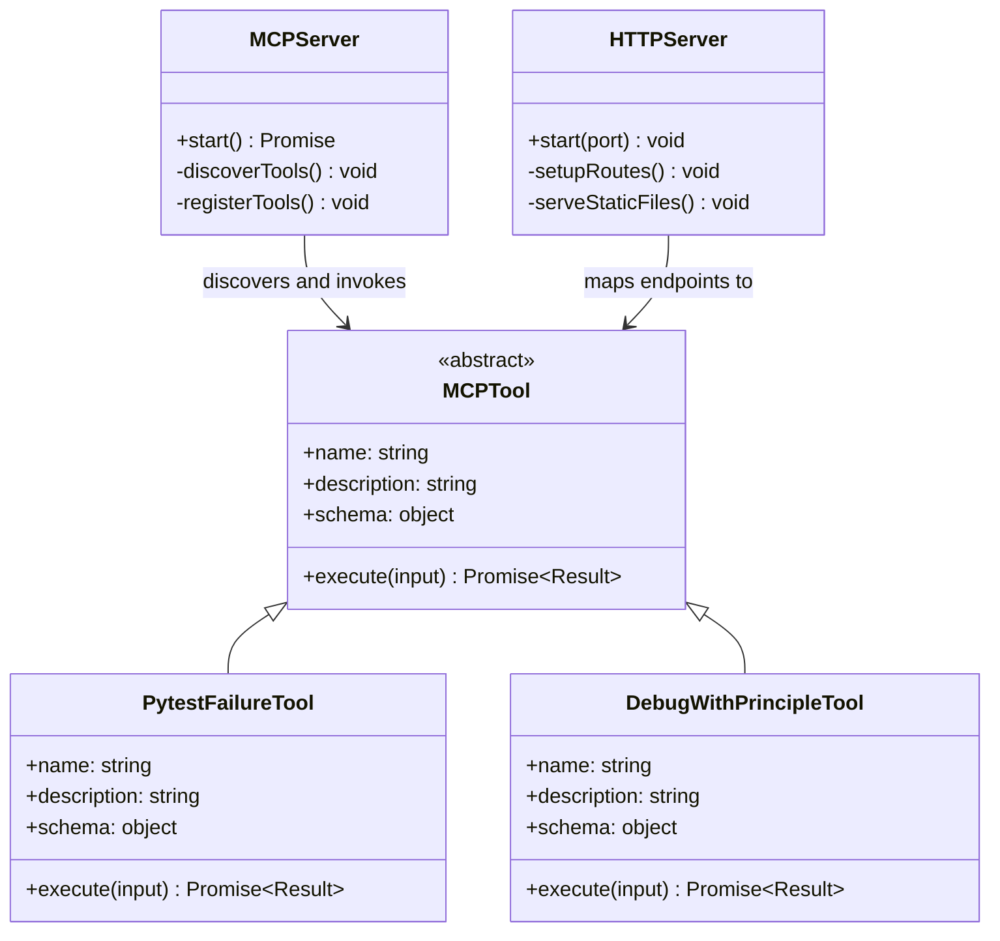
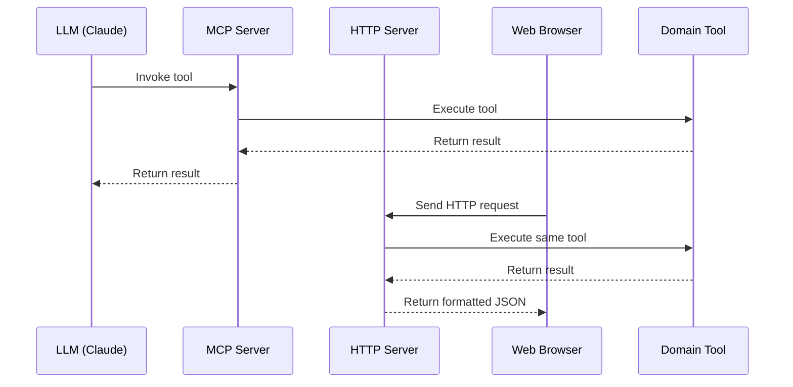

# Title: Multi-Interface Architecture (MCP and HTTP)

## Status: Accepted

## Context
The pytest debugging system needs to be accessible to different types of clients with varying requirements:

1. **LLMs and AI Tools**: Need programmatic access through a standardized protocol
2. **Web Browsers**: Need user-friendly interfaces for visualization and interaction
3. **Pytest Test Runner**: Needs a simple way to register failures during test execution

These different client types have different interface requirements, authentication needs, and usage patterns. Building separate systems for each would lead to duplication of code and potential inconsistencies.

The architecture needs to provide appropriate interfaces for each client type while maintaining a single core implementation of the debugging functionality.

## Decision
The architecture implements a multi-interface approach with two primary interfaces:

1. **Model Context Protocol (MCP) Interface**: For AI tools like Claude and other LLMs
   - Implemented using the MCP Framework
   - Allows direct tool invocation and discovery
   - Optimized for LLM interaction

2. **HTTP/REST API Interface**: For web browsers and programmatic access
   - Implemented using Express.js
   - Maps HTTP endpoints to the same core tools
   - Provides JSON-based responses
   - Serves the React-based web UI

The key aspects of this architecture are:

1. A single set of core domain tools (PytestFailureTool, DebugWithPrincipleTool, etc.) with all business logic
2. The MCP server providing LLM-friendly tool discovery and invocation
3. The HTTP server providing RESTful endpoints that map to the same tools
4. A web UI served by the HTTP server for visualization

This approach allows both interfaces to share the same underlying implementation, ensuring consistency across different access methods.

## Identified DDD Elements

### Bounded Contexts
1. **Infrastructure BC**: Contains the MCP server and HTTP server components that expose the domain functionality.

### Domain Services
1. **MCP Server**: Provides the MCP interface for AI tool access.
2. **HTTP Server**: Provides the REST API and serves the web UI.

### Entities
1. **MCP Tool Registration**: Represents a tool registered with the MCP server.
2. **HTTP Endpoint**: Represents an endpoint in the HTTP API.

## Dependencies/Interactions
- **MCP Server** ↔ **Domain Tools**: The MCP server discovers and invokes domain tools.
- **HTTP Server** ↔ **Domain Tools**: The HTTP server maps endpoints to domain tool invocations.
- **Web UI** ↔ **HTTP Server**: The web UI communicates with the backend via the HTTP API.
- **Pytest Client** ↔ **HTTP Server**: The pytest client sends failure data to the HTTP API.

## Technology/Patterns
1. **Adapter Pattern**: Used to adapt the domain tools to different interfaces.
2. **Facade Pattern**: The HTTP server provides a simplified interface to the underlying tools.
3. **MCP Framework**: Used for the LLM-friendly interface.
4. **Express.js**: Used for the HTTP/REST interface.

## Consequences

### Positive
1. **Interface Flexibility**: Different clients can access the system in the most appropriate way.
2. **Code Reuse**: Core domain logic is implemented once and accessed through multiple interfaces.
3. **Consistent Behavior**: All interfaces operate on the same underlying data and processes.
4. **LLM Integration**: First-class support for LLM-based debugging through MCP.
5. **Web Accessibility**: Complex debugging data can be visualized in a web browser.

### Negative
1. **Increased Complexity**: Managing multiple interfaces adds complexity to the codebase.
2. **Potential Inconsistencies**: Different interfaces might expose functionality differently.
3. **Authentication Challenges**: Different authentication requirements for different interfaces.
4. **Deployment Complexity**: Need to ensure both interfaces are properly deployed and configured.

## Diagrams

### Component Diagram

```mermaid
graph TD
    subgraph "Interfaces"
        MCPServer[MCP Server]
        HTTPServer[HTTP Server]
    end
    
    subgraph "Domain Tools"
        PytestFailureTool[PytestFailureTool]
        DebugWithPrincipleTool[DebugWithPrincipleTool]
        GetFailureInfoTool[GetFailureInfoTool]
        ListFailuresTool[ListFailuresTool]
        FailureAnalyticsTool[FailureAnalyticsTool]
        FailurePromptGeneratorTool[FailurePromptGeneratorTool]
        PytestDocsGuideTool[PytestDocsGuideTool]
    end

    subgraph "Clients"
        LLM[LLM (Claude)]
        WebBrowser[Web Browser]
        PytestClient[Pytest Client]
    end

    LLM -->|invokes tools via| MCPServer
    WebBrowser -->|HTTP requests to| HTTPServer
    PytestClient -->|register failures via| HTTPServer
    
    MCPServer -->|discovers and invokes| PytestFailureTool
    MCPServer -->|discovers and invokes| DebugWithPrincipleTool
    MCPServer -->|discovers and invokes| GetFailureInfoTool
    MCPServer -->|discovers and invokes| ListFailuresTool
    MCPServer -->|discovers and invokes| FailureAnalyticsTool
    MCPServer -->|discovers and invokes| FailurePromptGeneratorTool
    MCPServer -->|discovers and invokes| PytestDocsGuideTool
    
    HTTPServer -->|maps endpoints to| PytestFailureTool
    HTTPServer -->|maps endpoints to| DebugWithPrincipleTool
    HTTPServer -->|maps endpoints to| GetFailureInfoTool
    HTTPServer -->|maps endpoints to| ListFailuresTool
    HTTPServer -->|maps endpoints to| FailureAnalyticsTool
    HTTPServer -->|maps endpoints to| FailurePromptGeneratorTool
    HTTPServer -->|maps endpoints to| PytestDocsGuideTool
```

### Class Diagram for Multi-Interface Architecture



### Sequence Diagram for Multi-Interface Interaction

