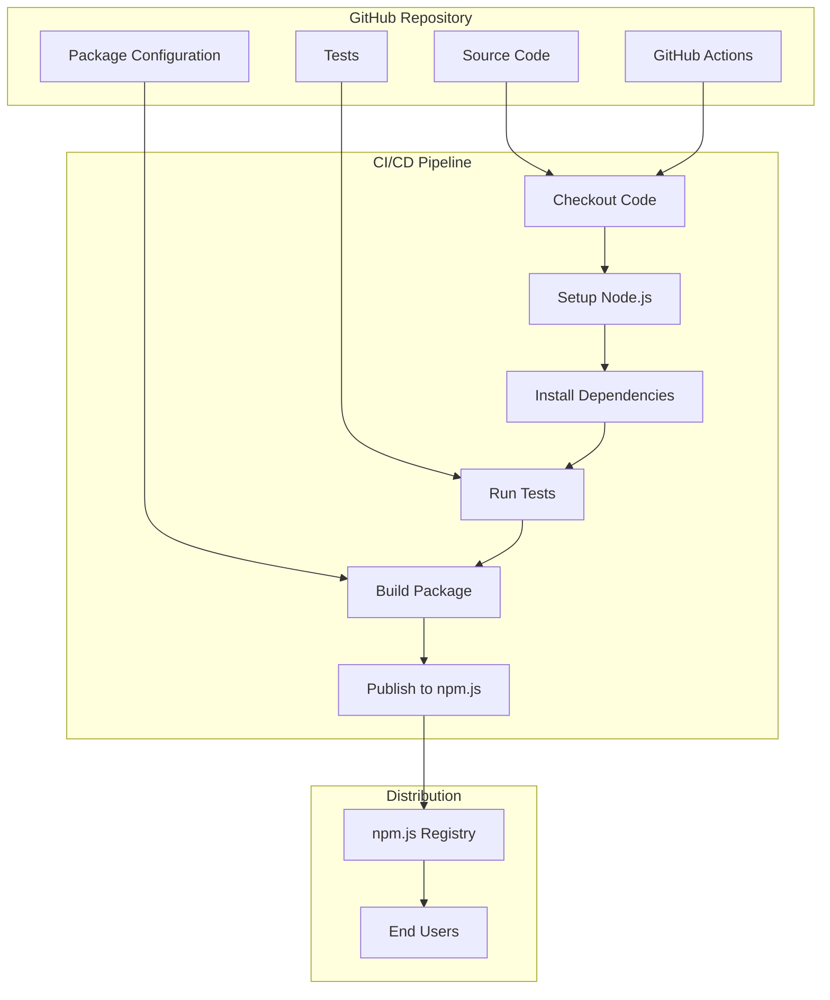
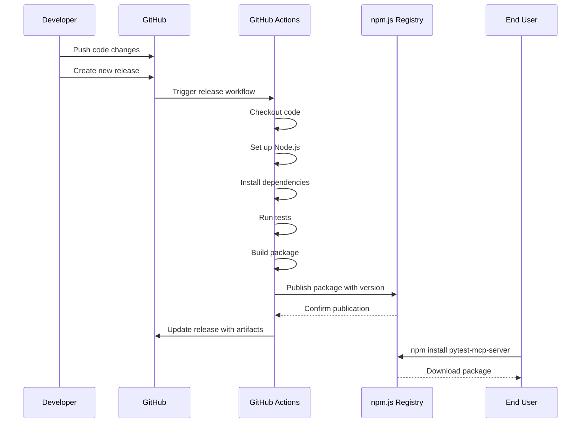

# Title: Automated npm.js Package Publishing

## Status: Proposed

## Context
The Pytest MCP Server needs to be easily installable by users. Currently, users must clone the repository and build it locally, which creates several potential issues:

1. Users need to understand Git and the build process
2. Version management becomes a manual process
3. Discoverability is limited to those who find the GitHub repository
4. Updates require manual intervention

Publishing to npm.js, the Node.js package registry, would allow users to install the package with a simple `npm install pytest-mcp-server` command. This would improve the user experience, increase discoverability, and simplify updates.

Additionally, the publishing process itself should be automated to ensure consistency and reduce manual errors. This automation should include version management, package building, and release publishing.

This decision affects the Infrastructure Bounded Context, particularly regarding deployment and distribution.

## Decision
We will publish the Pytest MCP Server as a package on npm.js and automate the process using GitHub Actions. Specifically:

1. **Package Configuration**: The package will be configured in the `package.json` file with appropriate metadata, dependencies, and scripts.

2. **GitHub Actions Workflow**: A GitHub Actions workflow will be created to automate the publishing process, triggered by release creation or manual dispatch.

3. **Versioning Strategy**: We will use Semantic Versioning (SemVer) to manage package versions.

4. **Access Control**: npm.js access tokens will be stored as GitHub Secrets to securely manage publishing rights.

5. **Release Documentation**: Each release will include automatically generated changelogs based on commit messages.

The GitHub Actions workflow will include the following steps:
1. Checkout code
2. Set up Node.js environment
3. Install dependencies
4. Run tests
5. Build the package
6. Publish to npm.js

## Identified DDD Elements

### Bounded Contexts
1. **Infrastructure BC**: The automation and publishing process primarily affects the infrastructure context of the application.

### Domain Services
1. **Release Management Service**: Conceptually, this represents the process and rules for releasing new versions.

## Dependencies/Interactions
- **GitHub Actions**: For workflow automation
- **npm.js Registry**: For package hosting
- **Node.js Build Tools**: For package preparation
- **Existing Codebase**: Must be structured appropriately for npm packaging

## Technology/Patterns
1. **CI/CD Pipeline**: Using GitHub Actions to automate the build, test, and publish workflow
2. **Secret Management**: Using GitHub Secrets for secure handling of npm.js access tokens
3. **Semantic Versioning**: For clear and consistent version numbering
4. **Git Tagging**: For release marking and version tracking

## Consequences

### Positive
1. **Simplified Installation**: Users can install the package with a single npm command
2. **Version Management**: Users can easily update to newer versions or pin to specific versions
3. **Increased Discoverability**: The package will be discoverable through npm.js search
4. **Automated Releases**: Reduced human error in the release process
5. **Better Dependency Management**: npm.js will handle dependency resolution

### Negative
1. **Additional Maintenance**: Need to maintain the npm package and GitHub Actions workflow
2. **Versioning Responsibility**: Must carefully follow semantic versioning to avoid breaking changes
3. **Security Considerations**: Must secure npm.js access tokens in GitHub Secrets
4. **Build Optimization**: May need to adjust the build process for optimal package size

## Diagrams

### Component Diagram



### Sequence Diagram for Release Process



## Implementation Plan

1. **Configure package.json**:
   ```json
   {
     "name": "pytest-mcp-server",
     "version": "1.0.0",
     "description": "MCP server for pytest debugging using the 9 principles",
     "main": "dist/index.js",
     "types": "dist/index.d.ts",
     "files": [
       "dist/**/*"
     ],
     "bin": {
       "pytest-mcp-server": "./dist/cli.js"
     },
     "scripts": {
       "build": "tsc",
       "test": "jest",
       "prepublishOnly": "npm run build"
     },
     // other configurations...
   }
   ```

2. **Create GitHub Actions workflow**:
   ```yaml
   name: Publish to npm.js

   on:
     release:
       types: [created]
     workflow_dispatch:
       inputs:
         version:
           description: 'Version to publish (e.g., 1.0.0)'
           required: true

   jobs:
     build-and-publish:
       runs-on: ubuntu-latest
       steps:
         - name: Checkout code
           uses: actions/checkout@v3
           
         - name: Set up Node.js
           uses: actions/setup-node@v3
           with:
             node-version: '18'
             registry-url: 'https://registry.npmjs.org'
             
         - name: Install dependencies
           run: npm ci
           
         - name: Run tests
           run: npm test
           
         - name: Build package
           run: npm run build
           
         - name: Publish to npm.js
           run: npm publish
           env:
             NODE_AUTH_TOKEN: ${{ secrets.NPM_TOKEN }}
   ```

3. **Set up GitHub Secret**:
   - Add an npm.js access token as a GitHub Secret named `NPM_TOKEN`

4. **Create a CLI Interface**:
   ```typescript
   #!/usr/bin/env node
   // cli.js - Command line interface for pytest-mcp-server
   
   import { MCPServer } from './index.js';
   
   // Parse command line arguments
   const argv = process.argv.slice(2);
   
   // Start the server
   const server = new MCPServer();
   server.start()
     .then(() => {
       console.log("Pytest MCP Server started successfully!");
     })
     .catch((error) => {
       console.error("Server startup error:", error);
       process.exit(1);
     });
   ```

## Alternatives Considered

1. **Manual Publishing**: 
   - Pros: Simpler implementation, more direct control
   - Cons: Error-prone, requires developer access, less consistent
   
2. **GitHub Packages**:
   - Pros: Tighter integration with GitHub
   - Cons: Less adoption, requires GitHub authentication for installation

3. **Private Registry**:
   - Pros: Complete control over distribution
   - Cons: Additional infrastructure, less accessible to public users 