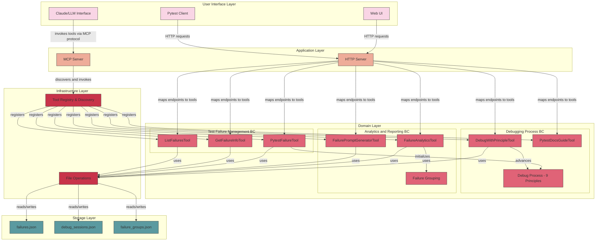

# Pytest MCP Server Architecture Overview

This document provides a high-level overview of the Pytest MCP Server architecture from a Domain-Driven Design perspective.

## Architecture Diagram

## Architecture Layers

### User Interface Layer
This layer provides various interfaces for interacting with the system:
- **Claude/LLM Interface**: Allows LLMs like Claude to interact with the system via the Model Context Protocol
- **Web UI**: React-based user interface for human interaction
- **Pytest Client**: Python client for direct integration with pytest test runs

### Application Layer
This layer coordinates the application's activities:
- **MCP Server**: Handles MCP protocol requests, tool discovery, and invocation
- **HTTP Server**: Provides RESTful API endpoints and serves the web UI

### Domain Layer
This layer contains the core business logic organized into bounded contexts:

#### Test Failure Management BC
- **PytestFailureTool**: Registers test failures
- **GetFailureInfoTool**: Retrieves failure information
- **ListFailuresTool**: Lists all failures

#### Debugging Process BC
- **DebugWithPrincipleTool**: Applies debugging principles
- **PytestDocsGuideTool**: Provides documentation and guidance
- **Debug Process**: Implements the 9 principles of debugging workflow

#### Analytics and Reporting BC
- **FailureAnalyticsTool**: Analyzes and groups failures
- **FailurePromptGeneratorTool**: Generates debugging prompts
- **Failure Grouping**: Implements strategies for grouping similar failures

### Infrastructure Layer
This layer provides technical capabilities to support the system:
- **Tool Registry & Discovery**: Discovers and registers MCP tools
- **File Operations**: Handles reading and writing to JSON files

### Storage Layer
This layer persists data:
- **failures.json**: Stores failure records
- **debug_sessions.json**: Stores debugging sessions
- **failure_groups.json**: Stores failure grouping analytics

## Key Domain Aggregates

### Failure Aggregate
- Root entity: `FailureRecord`
- Contains information about a test failure, its status, and related debug sessions

### Debug Session Aggregate
- Root entity: `DebugSession`
- Contains a sequence of `DebugStep` entities representing the application of each debugging principle

### Failure Group Aggregate
- Root entity: `FailureGroup`
- Contains references to multiple failures that share common characteristics

## Architecture Patterns

1. **Tool-Based Architecture**: Each capability is implemented as a separate `MCPTool`
2. **File-Based Storage**: Simple key-value storage in JSON files
3. **Multi-Interface Design**: Supports both MCP for LLMs and HTTP/REST for web clients
4. **Process-Oriented Debugging**: Structured workflow based on the 9 principles of debugging 